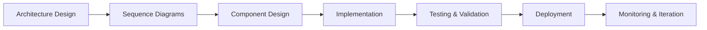

# Angular FinTech Micro-Frontend Enterprise Architecture

[](https://github.com/calvinlee999/Angular-Front-End-Development)
[](https://codecov.io)
[](https://snyk.io)
[](https://angular.io/)
[](https://www.typescriptlang.org/)

## 🏛️ Enterprise Architecture Overview

This repository contains the comprehensive blueprint for a **scalable, secure, and enterprise-grade Angular-based Micro-Frontend Architecture** specifically designed for **FinTech applications**. The solution follows a **principled, architecture-first approach** with detailed sequence diagrams, ensuring step-by-step explainability, auditability, and future enhancement capabilities.

### 🎯 FinTech Enterprise Goals

- **🔒 Security-First**: SOC 2, PCI DSS, GDPR compliant architecture
- **⚡ Performance**: Sub-second loading, real-time trading capabilities  
- **📈 Scalability**: Cloud-native, auto-scaling micro-frontend ecosystem
- **🔍 Observability**: Complete audit trails and monitoring
- **🛠️ Maintainability**: Domain-driven design with bounded contexts
- **🏗️ Enterprise-Grade**: Production-ready patterns and practices

## 📋 Table of Contents

- [Architecture Documentation](#architecture-documentation)
- [Technology Stack](#technology-stack)  
- [Project Structure](#project-structure)
- [Getting Started](#getting-started)
- [Development Workflow](#development-workflow)
- [Security & Compliance](#security--compliance)
- [Performance Targets](#performance-targets)
- [Contributing](#contributing)

## 📐 Architecture Documentation

### Core Architecture Documents

| Document | Purpose | Audience |
|----------|---------|----------|
| **[ARCHITECTURE.md](./ARCHITECTURE.md)** | Complete system architecture blueprint | Architects, Senior Engineers |
| **[SEQUENCE_DIAGRAMS.md](./SEQUENCE_DIAGRAMS.md)** | Detailed interaction flows and business processes | Engineers, QA, Product |

### Architecture Highlights

#### **Micro-Frontend Architecture**
```
┌─────────────────────────────────────────────┐
│            Shell Application                │
│  ┌─────────┐ ┌─────────┐ ┌─────────────┐   │
│  │Trading  │ │Portfolio│ │Risk Mgmt    │   │
│  │Micro-FE │ │Micro-FE │ │Micro-FE     │   │
│  └─────────┘ └─────────┘ └─────────────┘   │
├─────────────────────────────────────────────┤
│      Shared Component Library               │
├─────────────────────────────────────────────┤
│      Infrastructure & Cloud Services        │
└─────────────────────────────────────────────┘
```

#### **Key Architectural Decisions**
- **Framework**: Angular 18+ with Standalone Components
- **Module Federation**: Webpack 5 for micro-frontend orchestration
- **State Management**: NgRx for predictable state management
- **Component Library**: Design system with semantic versioning
- **Security**: Multi-factor authentication with RBAC
- **Deployment**: Azure Container Apps with auto-scaling

## 🛠️ Technology Stack

### **Frontend Technologies**
| Category | Technology | Version | Purpose |
|----------|------------|---------|---------|
| **Framework** | Angular | 18+ | Core framework |
| **Language** | TypeScript | 5.0+ | Type safety |  
| **State Management** | NgRx | 18+ | Predictable state |
| **UI Components** | Angular Material | 18+ | Base component library |
| **Module Federation** | Webpack | 5+ | Micro-frontend runtime |
| **Charts** | D3.js + ngx-charts | Latest | Financial visualization |
| **Testing** | Jest + Testing Library | Latest | Unit/integration testing |

### **Infrastructure & DevOps**
| Category | Technology | Purpose |
|----------|------------|---------|
| **Container** | Docker | Application packaging |
| **Orchestration** | Azure Container Apps | Container orchestration |
| **CI/CD** | Azure DevOps | Automated deployment |
| **Monitoring** | Azure Monitor + Prometheus | Observability |
| **Security** | Azure Key Vault | Secrets management |

### **FinTech-Specific Integrations**
- **Market Data**: WebSocket connections for real-time feeds
- **Trading APIs**: RESTful APIs with circuit breakers  
- **Risk Calculation**: High-performance risk computation engines
- **Compliance**: Audit logging with blockchain verification

## 📁 Project Structure

```
fintech-angular-microfrontends/
├── docs/                           # Architecture documentation
│   ├── ARCHITECTURE.md            # System architecture 
│   ├── SEQUENCE_DIAGRAMS.md       # Interaction flows
│   └── ADR/                       # Architecture Decision Records
├── apps/                          # Micro-frontend applications
│   ├── shell/                     # Host/shell application
│   ├── trading-mfe/              # Trading micro-frontend
│   ├── portfolio-mfe/            # Portfolio management
│   └── risk-mfe/                 # Risk management  
├── libs/                          # Shared libraries
│   ├── shared-ui/                # Component library
│   ├── data-access/              # Data services
│   ├── utils/                    # Utility functions
│   └── domain/                   # Domain logic
├── tools/                         # Development tools
│   ├── webpack/                  # Module federation configs
│   ├── build/                    # Build configurations
│   └── deployment/               # Infrastructure as Code
├── .github/                       # GitHub workflows  
│   └── workflows/                # CI/CD pipelines
└── README.md                      # This file
```

## 🚀 Getting Started

### Prerequisites

- **Node.js**: 18+ LTS
- **npm**: 9+  
- **Angular CLI**: 18+
- **Docker**: Latest stable
- **Azure CLI**: Latest (for deployment)

### Quick Start

```bash
# Clone the repository
git clone https://github.com/calvinlee999/Angular-Front-End-Development.git
cd Angular-Front-End-Development

# Install dependencies (when available)
npm install

# Start development environment (planned)
npm run start:dev

# Access applications
# Shell: http://localhost:4200
# Trading: http://localhost:4201  
# Portfolio: http://localhost:4202
# Risk: http://localhost:4203
```

### Architecture Review Process

1. **📖 Read Documentation**
   ```bash
   # Review architecture documents
   open ARCHITECTURE.md
   open SEQUENCE_DIAGRAMS.md
   ```

2. **🎯 Understand Business Domain**
   - Trading operations and order management
   - Portfolio analytics and performance tracking  
   - Risk assessment and compliance monitoring

3. **🏗️ Review Implementation Plan**
   - Phased delivery approach (12-week timeline)
   - Component library development strategy
   - Security and compliance requirements

## 🔄 Development Workflow

### Architecture-First Approach



### Implementation Phases

| Phase | Duration | Deliverables | Focus |
|-------|----------|--------------|-------|
| **Phase 1** | Weeks 1-2 | Shell App + Auth | Foundation |
| **Phase 2** | Weeks 3-4 | Trading MFE | Core business logic |  
| **Phase 3** | Weeks 5-6 | Portfolio MFE | Analytics & reporting |
| **Phase 4** | Weeks 7-8 | Risk MFE | Compliance & monitoring |
| **Phase 5** | Weeks 9-10 | Component Library | Reusability |
| **Phase 6** | Weeks 11-12 | Advanced Features | Polish & optimization |

### Code Quality Standards

- **Test Coverage**: 90%+ with Jest and Testing Library
- **TypeScript**: Strict mode enabled, no `any` types
- **Linting**: ESLint with Angular recommended rules  
- **Formatting**: Prettier with consistent configuration
- **Security**: Snyk vulnerability scanning on every PR

## 🔐 Security & Compliance

### Security Architecture

- **🔐 Authentication**: Multi-factor authentication (MFA)
- **🛡️ Authorization**: Role-based access control (RBAC)
- **🔒 Data Protection**: End-to-end encryption (AES-256)
- **📊 Audit Logging**: Immutable audit trails
- **🚫 Security Headers**: CSP, HSTS, X-Frame-Options

### Compliance Standards

| Standard | Implementation | Status |
|----------|---------------|---------|
| **SOC 2 Type II** | Audit logging, access controls | ✅ Designed |
| **PCI DSS** | Encryption, network security | ✅ Designed |  
| **GDPR** | Data privacy, right to deletion | ✅ Designed |
| **SOX** | Financial reporting controls | ✅ Designed |

## ⚡ Performance Targets

### Core Web Vitals (FinTech Optimized)

| Metric | Target | FinTech Requirement |
|--------|--------|-------------------|
| **First Contentful Paint** | < 1.5s | Sub-second market data display |
| **Largest Contentful Paint** | < 2.5s | Fast dashboard loading |
| **First Input Delay** | < 100ms | Responsive trading interface |
| **Cumulative Layout Shift** | < 0.1 | Stable financial data display |

### Trading-Specific Performance  

| Operation | Target Latency | Business Impact |
|-----------|---------------|-----------------|
| **Order Submission** | < 200ms | Competitive advantage |
| **Market Data Updates** | < 10ms | Real-time pricing |
| **Risk Calculations** | < 50ms | Regulatory compliance |
| **Portfolio Rebalancing** | < 1s | User experience |

## 🤝 Contributing

### Architecture Review Process

1. **📋 Architecture Decision Records (ADRs)**
   - All significant decisions documented
   - Template-based approach for consistency  
   - Peer review required for architectural changes

2. **🔄 Change Management**
   ```bash
   # Create feature branch
   git checkout -b feature/new-architecture-component
   
   # Update architecture docs first
   edit ARCHITECTURE.md
   edit SEQUENCE_DIAGRAMS.md
   
   # Implement changes
   # Test thoroughly  
   # Submit PR with architecture review
   ```

### Code Review Checklist

- [ ] Architecture documents updated
- [ ] Sequence diagrams reflect changes
- [ ] Security considerations addressed
- [ ] Performance impact assessed  
- [ ] Test coverage maintained (90%+)
- [ ] TypeScript strict mode compliance
- [ ] Accessibility requirements met

## 📈 Roadmap & Future Enhancements

### Immediate Goals (Next 3 Months)
- [ ] Complete shell application implementation
- [ ] Establish CI/CD pipeline
- [ ] Deploy first micro-frontend (Trading)
- [ ] Implement shared component library

### Medium-term Goals (3-6 Months)
- [ ] All micro-frontends deployed to production
- [ ] Advanced monitoring and observability
- [ ] Performance optimization (Core Web Vitals)
- [ ] Enhanced security features

### Long-term Vision (6+ Months)  
- [ ] AI-powered risk assessment
- [ ] Advanced analytics and reporting
- [ ] Multi-region deployment
- [ ] Mobile-responsive enhancements

## 📞 Support & Contact

### Architecture Team
- **Lead Front-End Architect**: [Architecture decisions and strategic direction]
- **Principal Angular Engineer**: [Technical implementation and best practices]
- **DevOps Engineer**: [Infrastructure and deployment pipeline]
- **Security Engineer**: [Security architecture and compliance]

### Documentation
- **Architecture Questions**: Review [ARCHITECTURE.md](./ARCHITECTURE.md)
- **Flow Questions**: Review [SEQUENCE_DIAGRAMS.md](./SEQUENCE_DIAGRAMS.md)  
- **Implementation Issues**: Create GitHub issue with appropriate labels

---

## 📄 License

This project is licensed under the MIT License - see the [LICENSE](LICENSE) file for details.

## 🎖️ Acknowledgments

- **Angular Team**: For the robust framework and excellent documentation
- **Webpack Module Federation**: Enabling micro-frontend architecture
- **FinTech Community**: For sharing best practices and compliance guidance
- **Enterprise Architecture Patterns**: Drawing from industry-proven approaches

---

**Built with 💡 by enterprise architects for the FinTech industry**

*This project demonstrates a comprehensive, architecture-first approach to building scalable Angular applications for financial services.*