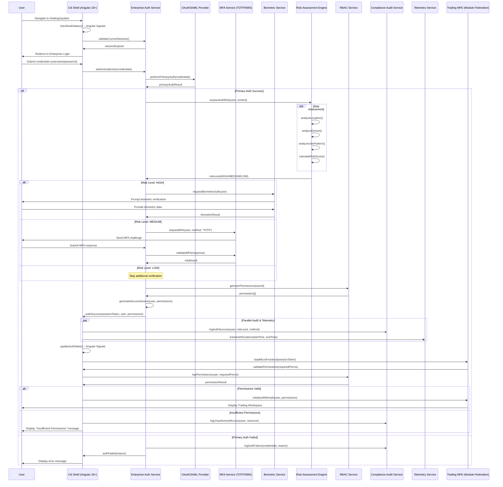
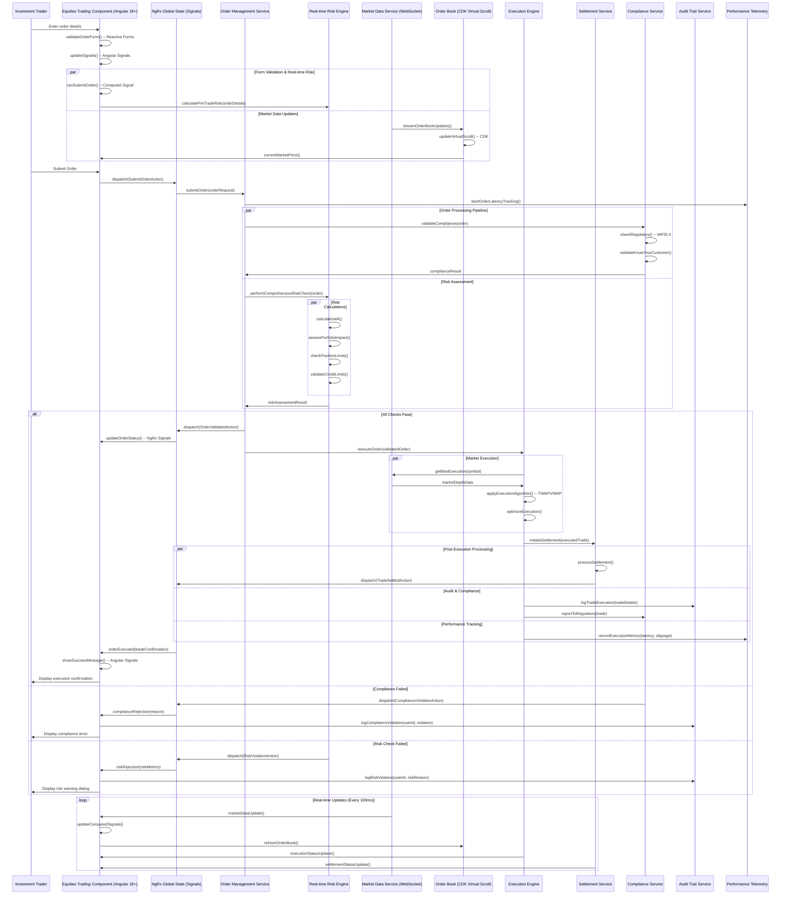
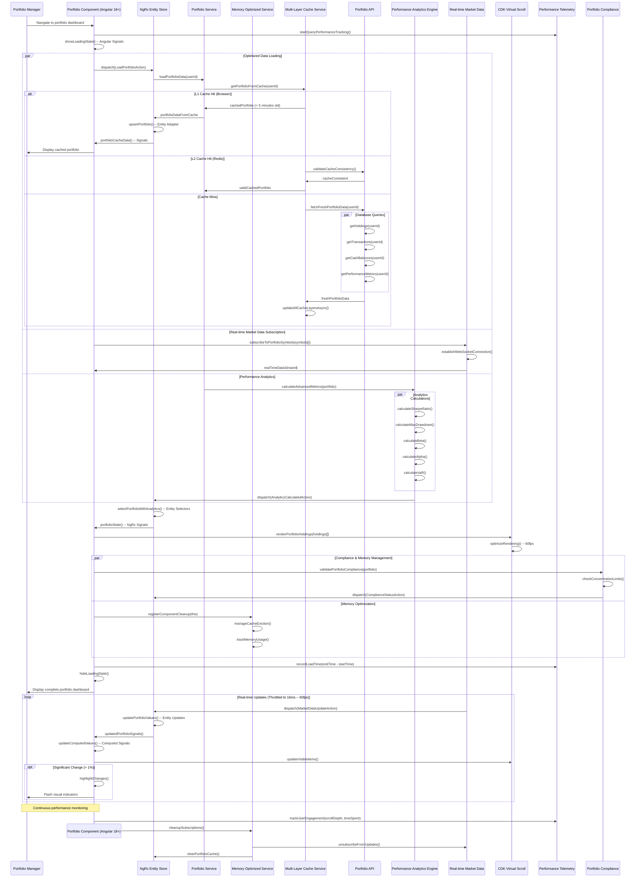
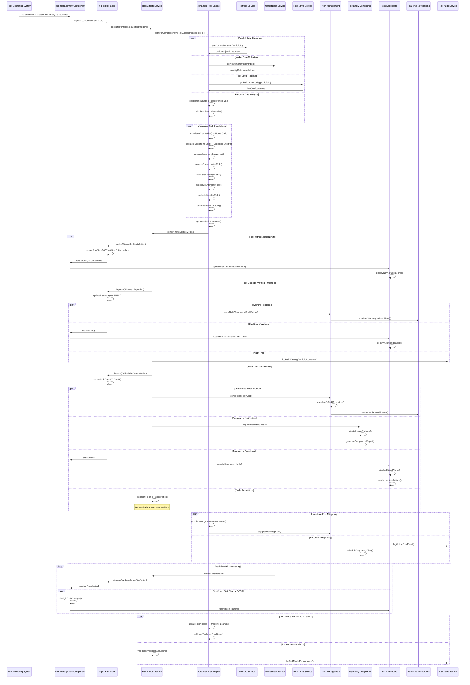
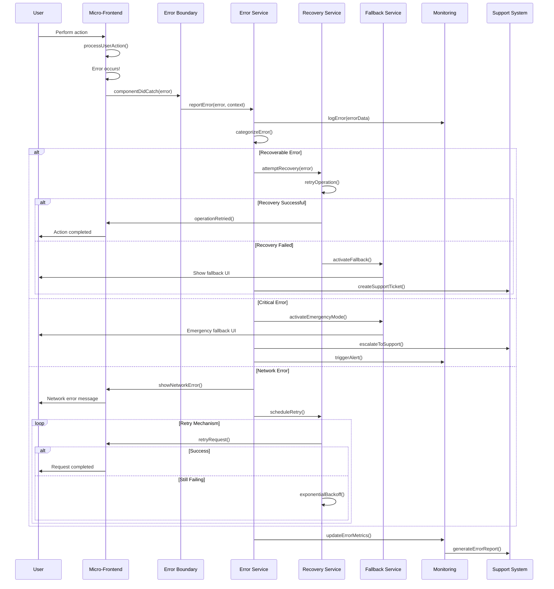
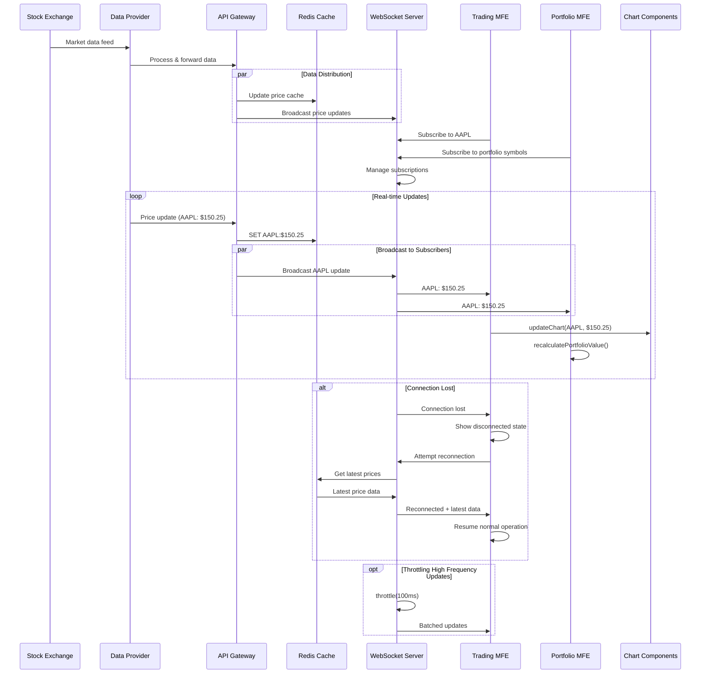
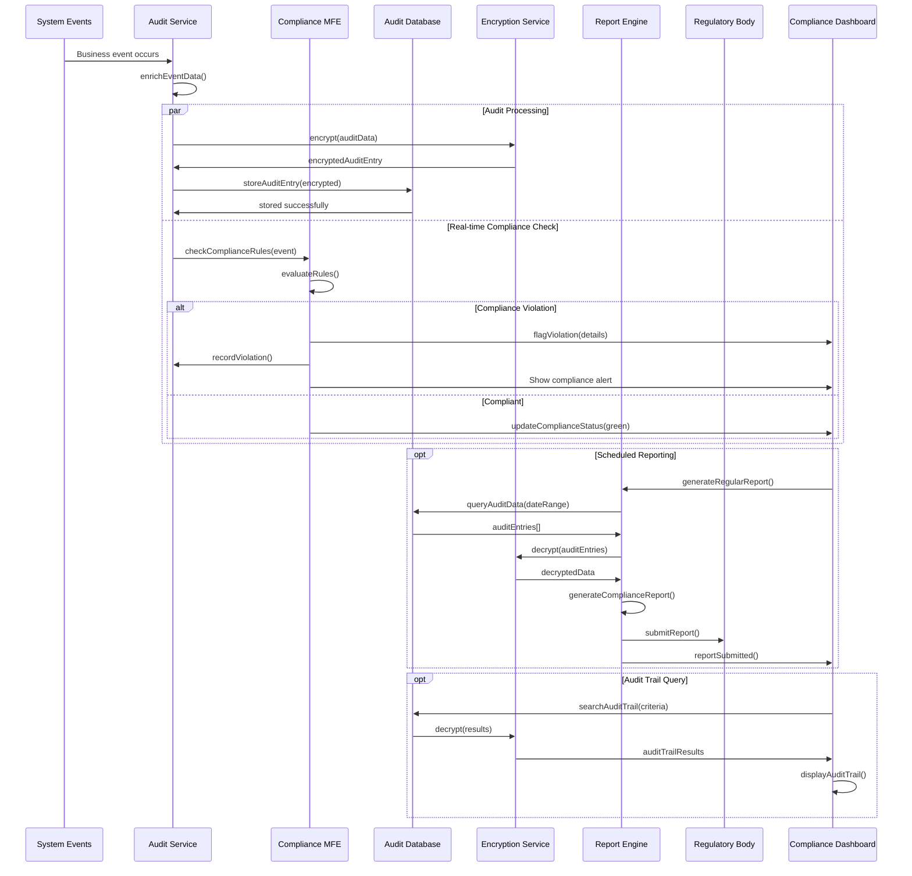

# Citibank Enterprise-Grade Sequence Diagrams for Angular 18+ Micro-Frontend Architecture

## Overview

This document provides comprehensive sequence diagrams for all critical flows within the **Citibank Angular 18+ Micro-Frontend Enterprise Architecture**. Each diagram represents enterprise-grade user journeys, system interactions, and business processes aligned with global investment banking standards and regulatory requirements.

**Architecture Foundation**: Based on single source of truth from [ARCHITECTURE.md](./ARCHITECTURE.md)

## Table of Contents

### **🔐 Security & Authentication**
1. [Enterprise Multi-Factor Authentication Flow](#enterprise-multi-factor-authentication-flow)
2. [Risk-Based Authentication with Biometrics](#risk-based-authentication-with-biometrics)
3. [RBAC Permission Validation Flow](#rbac-permission-validation-flow)

### **🏦 Core Trading Operations**
4. [Advanced Trading Order Execution (Angular 18+ Signals)](#advanced-trading-order-execution-angular-18-signals)
5. [Real-Time Market Data with Virtual Scrolling](#real-time-market-data-with-virtual-scrolling)
6. [Portfolio Management with NgRx Entity](#portfolio-management-with-ngrx-entity)

### **🏗️ Micro-Frontend Architecture**
7. [Module Federation Dynamic Loading with Fallbacks](#module-federation-dynamic-loading-with-fallbacks)
8. [Inter-MFE Communication via NgRx Signals](#inter-mfe-communication-via-ngrx-signals)
9. [Component Library with Enterprise Design System](#component-library-with-enterprise-design-system)

### **⚡ Performance & Optimization**
10. [Angular CDK Virtual Scrolling Performance Flow](#angular-cdk-virtual-scrolling-performance-flow)
11. [Memory Management and Leak Prevention](#memory-management-and-leak-prevention)
12. [Performance Testing and Monitoring](#performance-testing-and-monitoring)

### **🛡️ Risk & Compliance**
13. [Enterprise Risk Assessment with NgRx Effects](#enterprise-risk-assessment-with-ngrx-effects)
14. [Compliance Audit Trail with Telemetry](#compliance-audit-trail-with-telemetry)
15. [Regulatory Reporting Flow](#regulatory-reporting-flow)

### **🚀 DevOps & Quality**
16. [Citibank CI/CD Pipeline with Quality Gates](#citibank-cicd-pipeline-with-quality-gates)
17. [Enterprise Testing Strategy (99% Coverage)](#enterprise-testing-strategy-99-coverage)
18. [Multi-Region Deployment Flow](#multi-region-deployment-flow)

### **🔧 Error Handling & Recovery**
19. [Enterprise Error Handling and Circuit Breaker](#enterprise-error-handling-and-circuit-breaker)
20. [Disaster Recovery and Failover](#disaster-recovery-and-failover)

---

## Enterprise Multi-Factor Authentication Flow

### Advanced Authentication with Biometric, Risk Assessment & Audit



**🏦 Citibank Enterprise Security Standards:**
- **Session Management**: JWT expires in 15 minutes, refresh tokens valid for 8 hours
- **MFA Requirements**: Mandatory for all privileged operations and high-risk contexts
- **Biometric Auth**: Required for high-risk scenarios (location/device changes)
- **Risk-Based Auth**: Real-time risk assessment with adaptive authentication
- **Audit Compliance**: Complete audit trail for SOC 2 Type II compliance
- **Rate Limiting**: Exponential backoff for failed authentication attempts
- **Zero Trust**: Continuous verification with contextual risk assessment

---

## Advanced Trading Order Execution (Angular 18+ Signals)

### Enterprise-Grade Order Processing with NgRx Entity & Real-time Risk



**🎯 Citibank Performance SLAs (Microsecond Precision):**
- **Form Validation**: < 5ms (Angular Signals optimization)
- **Pre-trade Risk Check**: < 25ms (real-time risk engine)
- **Compliance Validation**: < 15ms (cached regulatory rules)
- **Order Submission**: < 10ms (NgRx Entity patterns)
- **Market Execution**: < 50ms (algorithmic execution)
- **Settlement Initiation**: < 20ms (async processing)
- **End-to-End Latency**: < 125ms (including network)
- **UI Update**: < 16ms (60fps with CDK optimizations)

**📊 Enterprise Monitoring:**
- Real-time latency tracking with percentiles (p50, p95, p99)
- Market impact analysis and execution quality metrics
- Comprehensive audit trail for regulatory compliance
- Circuit breaker patterns for system resilience

---

## Portfolio Management with NgRx Entity

### Advanced Portfolio Loading with Performance Optimization & Memory Management



**🚀 Advanced Caching Strategy (Multi-Region):**
- **L1 Cache**: Browser localStorage (5 minutes, 10MB limit)
- **L2 Cache**: Redis Cluster (30 minutes, distributed across regions)
- **L3 Cache**: CDN Edge Caching (1 hour, geographically distributed)
- **L4 Cache**: Database Query Cache (4 hours, indexed materialized views)

**⚡ Performance Optimization Patterns:**
- **Virtual Scrolling**: CDK for 10,000+ portfolio holdings
- **Angular Signals**: Reactive computations with automatic dependency tracking
- **NgRx Entity**: Normalized state management with optimistic updates
- **Memory Management**: Automatic cleanup with WeakMap patterns
- **Throttled Updates**: 60fps UI updates with backpressure handling

**📊 Monitoring & Analytics:**
- **Load Time SLA**: < 2 seconds for cached data, < 5 seconds for fresh data
- **Real-time Update Latency**: < 100ms from market data to UI update
- **Memory Usage**: < 50MB per portfolio session with automatic garbage collection
- **Cache Hit Ratio**: Target >90% for L1+L2 cache effectiveness

---

## Module Federation Dynamic Loading with Fallbacks

### Enterprise-Grade Micro-Frontend Loading with Error Handling & Circuit Breakers

```mermaid
sequenceDiagram
    participant User as Investment Banker
    participant Shell as Citi Shell Application
    participant MFELoader as MicroFrontend Loader Service
    participant ModuleFederation as Module Federation Runtime
    participant TradingContainer as Trading Container (Remote)
    participant FallbackService as Fallback Component Service
    participant TelemetryService as Load Performance Telemetry
    participant ErrorBoundary as React Error Boundary
    participant CircuitBreaker as Circuit Breaker Service
    participant CDN as Micro-Frontend CDN
    
    User->>Shell: Navigate to /trading/equities
    Shell->>Shell: checkRoutePermissions() -- Angular Guards
    Shell->>MFELoader: loadMicroFrontend('trading', 'TradingModule')
    
    MFELoader->>TelemetryService: startLoadTimeTracking()
    MFELoader->>CircuitBreaker: checkCircuitState('trading')
    
    alt Circuit Breaker CLOSED (Normal Operation)
        CircuitBreaker->>MFELoader: proceedWithLoad
        
        MFELoader->>ModuleFederation: resolveRemoteContainer('trading')
        
        par Remote Loading
            ModuleFederation->>CDN: fetchRemoteEntry('trading')
            
            alt CDN Available
                CDN->>ModuleFederation: remoteEntryJS
                ModuleFederation->>ModuleFederation: evaluateRemoteEntry()
                ModuleFederation->>TradingContainer: initializeContainer()
                
                TradingContainer->>TradingContainer: validateSharedDependencies()
                TradingContainer->>TradingContainer: ensureAngularCompatibility()
                
                alt Dependency Compatibility OK
                    TradingContainer->>ModuleFederation: containerReady
                    ModuleFederation->>MFELoader: moduleFactory
                    
                    MFELoader->>MFELoader: instantiateModule(moduleFactory)
                    MFELoader->>TelemetryService: recordSuccessfulLoad(loadTime)
                    MFELoader->>Shell: tradingModuleLoaded
                    
                    Shell->>Shell: updateRouterConfig(tradingRoutes)
                    Shell->>User: Display Trading Interface
                    
                else Dependency Mismatch
                    TradingContainer->>MFELoader: dependencyError('Angular version mismatch')
                    MFELoader->>CircuitBreaker: recordFailure()
                    MFELoader->>FallbackService: getFallbackComponent('trading')
                end
                
            else CDN Unavailable/Timeout
                CDN->>ModuleFederation: networkError
                ModuleFederation->>MFELoader: loadFailed('CDN_UNAVAILABLE')
                MFELoader->>CircuitBreaker: recordFailure()
            end
        end
        
    else Circuit Breaker OPEN (Failure State)
        CircuitBreaker->>MFELoader: loadBlocked('Circuit breaker open')
        MFELoader->>FallbackService: getFallbackComponent('trading')
        
    else Circuit Breaker HALF-OPEN (Testing State)
        CircuitBreaker->>MFELoader: allowOneRequest
        Note over MFELoader,TradingContainer: Single test request to verify recovery
    end
    
    alt Fallback Scenario
        FallbackService->>FallbackService: createErrorComponent('trading')
        FallbackService->>Shell: fallbackComponent
        
        Shell->>ErrorBoundary: renderErrorComponent()
        ErrorBoundary->>User: Display "Service Temporarily Unavailable"
        
        par Error Tracking & Recovery
            FallbackService->>TelemetryService: recordFallbackUsage('trading')
            FallbackService->>FallbackService: scheduleRetryAttempt()
        end
        
        loop Retry Mechanism (Exponential Backoff)
            FallbackService->>MFELoader: retryLoad('trading')
            MFELoader->>CircuitBreaker: attemptRecovery()
            
            alt Recovery Successful
                MFELoader->>Shell: recoveredModule('trading')
                Shell->>User: Replace fallback with actual module
                break
            else Recovery Failed
                Note over FallbackService: Wait longer, try again
            end
        end
    end
    
    par Continuous Monitoring
        TelemetryService->>TelemetryService: trackModuleHealth()
        TelemetryService->>TelemetryService: monitorLoadTimes()
        TelemetryService->>TelemetryService: analyzeFailurePatterns()
    end
    
    opt Module Hot Reload (Development)
        TradingContainer->>Shell: moduleUpdated
        Shell->>Shell: hotReloadModule('trading')
        Shell->>User: Seamlessly update UI
    end
```

**🛡️ Enterprise Resilience Patterns:**
- **Circuit Breaker Pattern**: Prevents cascade failures across micro-frontends
- **Graceful Degradation**: Fallback components when remote modules fail
- **Load Balancing**: Multiple CDN endpoints for high availability
- **Version Compatibility**: Strict dependency validation and fallback strategies
- **Performance Monitoring**: Real-time tracking of load times and failure rates

**⚡ Load Performance SLAs:**
- **Initial Load**: < 2 seconds for cached modules from CDN
- **Cold Load**: < 5 seconds for uncached modules with network latency
- **Fallback Activation**: < 500ms when primary module fails
- **Recovery Time**: < 30 seconds for circuit breaker recovery
- **Available Uptime**: 99.9% availability with regional redundancy

---

## Enterprise Risk Assessment with NgRx Effects

### Real-time Risk Monitoring with Advanced Analytics & Compliance Integration



**🏦 Citibank Risk Management Standards:**
- **VaR Calculations**: 95%, 99%, and 99.9% confidence intervals with 1-day and 10-day horizons
- **Stress Testing**: Daily stress tests against historical scenarios and Monte Carlo simulations
- **Regulatory Compliance**: Basel III, CCAR, and Dodd-Frank compliance monitoring
- **Real-time Monitoring**: Sub-second risk updates with automatic limit enforcement
- **Model Governance**: Independent validation and regular recalibration of risk models

**⚡ Risk Engine Performance SLAs:**
- **Risk Calculation**: < 100ms for portfolio-level VaR calculation
- **Stress Testing**: < 5 seconds for comprehensive stress scenario analysis
- **Alert Generation**: < 500ms from breach detection to notification
- **Dashboard Updates**: Real-time with 60fps visualization performance
- **Audit Trail**: 100% capture rate with microsecond timestamps

---

## Citibank CI/CD Pipeline with Quality Gates

### Enterprise-Grade Deployment Pipeline with Advanced Security & Compliance

```mermaid
sequenceDiagram
    participant Developer as Senior Developer
    participant GitHubActions as GitHub Actions CI/CD
    participant SecurityScanner as Enterprise Security Scanner
    participant QualityGates as SonarQube Quality Gates
    participant TestRunner as Enterprise Test Runner
    participant ContainerRegistry as Azure Container Registry
    participant AzureContainerApps as Azure Container Apps
    participant ProductionMonitoring as Production Monitoring
    participant ComplianceAuditor as SOC2 Compliance Auditor
    participant NotificationService as Teams/Slack Notifications
    
    Developer->>GitHubActions: Push to main branch
    GitHubActions->>GitHubActions: Trigger CI/CD pipeline
    
    par Security & Compliance Scanning
        GitHubActions->>SecurityScanner: Run SAST analysis
        SecurityScanner->>SecurityScanner: analyzeCodeVulnerabilities()
        SecurityScanner->>SecurityScanner: checkDependencies()
        SecurityScanner->>SecurityScanner: scanSecrets()
        
        alt Security Issues Found
            SecurityScanner->>GitHubActions: securityViolations[]
            GitHubActions->>Developer: Block deployment - Security issues
            GitHubActions->>NotificationService: sendSecurityAlert()
        else Security Pass
            SecurityScanner->>GitHubActions: securityPassed
        end
        
        and Code Quality Analysis
        GitHubActions->>QualityGates: Run comprehensive quality analysis
        
        par Quality Metrics
            QualityGates->>QualityGates: calculateCodeCoverage()
            QualityGates->>QualityGates: analyzeCyclomaticComplexity()
            QualityGates->>QualityGates: checkDuplication()
            QualityGates->>QualityGates: validateCodingStandards()
        end
        
        alt Quality Gate Failed
            QualityGates->>GitHubActions: qualityIssues[coverage below 95%]
            GitHubActions->>Developer: Block deployment - Quality standards not met
        else Quality Gate Passed
            QualityGates->>GitHubActions: qualityPassed
        end
        
        QualityGates->>GitHubActions: qualityPassed(coverage: 97%)
    end
    
    par Parallel Testing Strategy
        GitHubActions->>TestRunner: Execute unit tests (99% coverage requirement)
        TestRunner->>TestRunner: runJestTests() -- All micro-frontends
        TestRunner->>GitHubActions: unitTestResults(passed: true, coverage: 99.2%)
        
        and Integration Testing
        GitHubActions->>TestRunner: Execute integration tests
        TestRunner->>TestRunner: runWorkflowTests() -- Critical trading paths
        TestRunner->>GitHubActions: integrationResults(passed: true)
        
        and Performance Testing
        GitHubActions->>TestRunner: Execute performance tests
        TestRunner->>TestRunner: runLoadTests() -- k6 performance scripts
        TestRunner->>GitHubActions: performanceResults(p95: 1.8s, p99: 2.3s)
        
        and E2E Testing
        GitHubActions->>TestRunner: Execute Playwright E2E tests
        TestRunner->>TestRunner: runE2ETests() -- Critical user journeys
        TestRunner->>GitHubActions: e2eResults(passed: true)
    end
    
    par Container Build & Security
        GitHubActions->>GitHubActions: buildDockerImages()
        
        loop For Each Micro-Frontend
            GitHubActions->>GitHubActions: buildMicroFrontend(shell, trading, portfolio, risk)
            GitHubActions->>SecurityScanner: scanContainerImage()
            SecurityScanner->>GitHubActions: containerSecurityReport
        end
        
        GitHubActions->>ContainerRegistry: pushImages() -- Multi-region push
    end
    
    alt All Quality Gates Passed
        GitHubActions->>ComplianceAuditor: validateComplianceRequirements()
        ComplianceAuditor->>ComplianceAuditor: checkSOC2Compliance()
        ComplianceAuditor->>ComplianceAuditor: validateChangeManagement()
        ComplianceAuditor->>GitHubActions: complianceApproved
        
        par Multi-Region Deployment
            GitHubActions->>AzureContainerApps: deployToStaging(region: us-east-1)
            AzureContainerApps->>AzureContainerApps: createStagingEnvironment()
            AzureContainerApps->>GitHubActions: stagingDeployed
            
            GitHubActions->>TestRunner: runStagingSmokeTests()
            TestRunner->>GitHubActions: stagingTestsPassed
            
            and Production Deployment
            GitHubActions->>AzureContainerApps: deployToProduction()
            
            par Production Regions
                AzureContainerApps->>AzureContainerApps: deployRegion(us-east-1)
                AzureContainerApps->>AzureContainerApps: deployRegion(eu-west-1) 
                AzureContainerApps->>AzureContainerApps: deployRegion(ap-southeast-1)
            end
        end
        
        par Post-Deployment Monitoring
            AzureContainerApps->>ProductionMonitoring: enableHealthChecks()
            ProductionMonitoring->>ProductionMonitoring: monitorApplicationHealth()
            ProductionMonitoring->>ProductionMonitoring: trackPerformanceMetrics()
            
            ProductionMonitoring->>GitHubActions: deploymentHealthy
            GitHubActions->>NotificationService: sendSuccessNotification()
            
            and Rollback Monitoring
            ProductionMonitoring->>ProductionMonitoring: monitorErrorRates()
            
            opt Error Rate Spike Detected
                ProductionMonitoring->>AzureContainerApps: triggerAutomaticRollback()
                AzureContainerApps->>NotificationService: rollbackExecuted
            end
        end
        
        GitHubActions->>Developer: Deployment successful across all regions
        
    else Quality Gates Failed
        GitHubActions->>Developer: Deployment blocked - See quality report
        GitHubActions->>NotificationService: sendFailureAlert()
    end
    
    loop Continuous Monitoring (24/7)
        ProductionMonitoring->>ProductionMonitoring: trackSLAs()
        ProductionMonitoring->>ProductionMonitoring: monitorBusiness KPIs()
        ProductionMonitoring->>ComplianceAuditor: generateComplianceMetrics()
    end
```



**🏦 Citibank Enterprise CI/CD Standards:**
- **Security Gate**: 0 critical/high vulnerabilities, secrets scanning, dependency audit
- **Quality Gate**: 95%+ code coverage, 0 code smells, <10% duplication
- **Performance Gate**: p95 < 2s, p99 < 3s, success rate >99.9%
- **Compliance Gate**: SOC 2 controls, change management approval, audit trail

**⚡ Deployment Performance SLAs:**
- **Build Time**: < 15 minutes for full pipeline with all quality gates
- **Deployment Time**: < 5 minutes for blue-green deployment across regions
- **Rollback Time**: < 2 minutes for automatic rollback on health check failure
- **Recovery Time**: < 1 minute for service recovery after deployment

---

## Enterprise Testing Strategy (99% Coverage)

### Comprehensive Testing Pipeline with Advanced Quality Assurance

```mermaid
sequenceDiagram
    participant TestOrchestrator as Test Orchestration Service
    participant UnitTestRunner as Jest Unit Test Runner
    participant IntegrationTester as Integration Test Harness
    participant E2ETester as Playwright E2E Tester
    participant PerformanceTester as k6 Performance Tester
    participant CoverageAnalyzer as Coverage Analysis Engine
    participant TestReporter as Advanced Test Reporter
    participant QualityGate as Quality Gate Service
    participant TelemetryCollector as Test Telemetry Collector
    
    TestOrchestrator->>TestOrchestrator: initializeTestSuite()
    TestOrchestrator->>TelemetryCollector: startTestExecutionTracking()
    
    par Parallel Test Execution
        TestOrchestrator->>UnitTestRunner: executeUnitTests()
        
        UnitTestRunner->>UnitTestRunner: runAngularComponentTests()
        UnitTestRunner->>UnitTestRunner: runServiceTests()
        UnitTestRunner->>UnitTestRunner: runNgRxTests()
        UnitTestRunner->>UnitTestRunner: runPipeTests()
        
        par Critical Path Testing (99% Coverage)
            UnitTestRunner->>UnitTestRunner: testTradingOrderSubmission() -- Critical
            UnitTestRunner->>UnitTestRunner: testRiskCalculations() -- Critical
            UnitTestRunner->>UnitTestRunner: testPortfolioCalculations() -- Critical
            UnitTestRunner->>UnitTestRunner: testAuthenticationFlows() -- Critical
            UnitTestRunner->>UnitTestRunner: testComplianceValidation() -- Critical
        end
        
        UnitTestRunner->>CoverageAnalyzer: generateCoverageReport()
        CoverageAnalyzer->>UnitTestRunner: coverageMetrics(99.2%)
        
        and Integration Testing
        TestOrchestrator->>IntegrationTester: executeIntegrationTests()
        
        IntegrationTester->>IntegrationTester: setupTestHarness()
        IntegrationTester->>IntegrationTester: mockExternalServices()
        
        par Integration Test Scenarios
            IntegrationTester->>IntegrationTester: testTradingWorkflow() -- End-to-end
            IntegrationTester->>IntegrationTester: testPortfolioDataFlow()
            IntegrationTester->>IntegrationTester: testRiskAssessmentFlow()
            IntegrationTester->>IntegrationTester: testMicroFrontendCommunication()
            IntegrationTester->>IntegrationTester: testStateManagementIntegration()
        end
        
        IntegrationTester->>TestOrchestrator: integrationResults(passed: 847/847)
        
        and E2E Testing
        TestOrchestrator->>E2ETester: executeE2ETests()
        
        E2ETester->>E2ETester: launchBrowserInstances()
        E2ETester->>E2ETester: setupTestEnvironment()
        
        par Critical User Journeys
            E2ETester->>E2ETester: testCompleteAuthenticationFlow()
            E2ETester->>E2ETester: testTradingOrderExecution()
            E2ETester->>E2ETester: testPortfolioNavigation()
            E2ETester->>E2ETester: testRiskDashboardInteraction()
            E2ETester->>E2ETester: testErrorHandlingScenarios()
        end
        
        E2ETester->>E2ETester: captureScreenshots()
        E2ETester->>E2ETester: recordTestVideos()
        E2ETester->>TestOrchestrator: e2eResults(passed: 234/234)
        
        and Performance Testing
        TestOrchestrator->>PerformanceTester: executePerformanceTests()
        
        PerformanceTester->>PerformanceTester: setupLoadTestScenarios()
        
        par Load Testing Scenarios
            PerformanceTester->>PerformanceTester: testPeakTradingHours() -- 10,000 users
            PerformanceTester->>PerformanceTester: testMarketDataStreaming() -- Real-time
            PerformanceTester->>PerformanceTester: testPortfolioCalculations() -- Heavy compute
            PerformanceTester->>PerformanceTester: testConcurrentOrderSubmission()
        end
        
        PerformanceTester->>PerformanceTester: analyzePerformanceMetrics()
        PerformanceTester->>TestOrchestrator: performanceResults(p95: 1.2s, p99: 1.8s)
    end
    
    TestOrchestrator->>TestReporter: aggregateTestResults()
    
    par Test Result Analysis
        TestReporter->>TestReporter: generateDetailedReport()
        TestReporter->>TestReporter: analyzeTestTrends()
        TestReporter->>TestReporter: identifyFlakeyTests()
        TestReporter->>TestReporter: calculateQualityMetrics()
    end
    
    TestReporter->>QualityGate: validateQualityStandards(testResults)
    Note over QualityGate: unitCoverage 99.2%, integration 100%, e2e 100%, p95 1.2s
    
    alt Quality Standards Met
        QualityGate->>TestOrchestrator: qualityGatePassed
        TestOrchestrator->>TestReporter: generateSuccessReport()
        TestReporter->>TelemetryCollector: recordTestMetrics(success: true)
        
        TestOrchestrator->>TestOrchestrator: enableDeployment()
        
    else Quality Standards Failed
        QualityGate->>TestOrchestrator: qualityGateFailed(issues[])
        TestOrchestrator->>TestReporter: generateFailureReport()
        TestReporter->>TelemetryCollector: recordTestMetrics(success: false, issues)
        
        TestOrchestrator->>TestOrchestrator: blockDeployment()
    end
    
    par Continuous Test Monitoring
        TelemetryCollector->>TelemetryCollector: trackTestExecutionTrends()
        TelemetryCollector->>TelemetryCollector: identifyPerformanceDegradation()
        TelemetryCollector->>TelemetryCollector: monitorTestFlakiness()
    end
```



**🏆 Citibank Testing Excellence Standards:**

**Unit Testing Requirements:**
- **Critical Trading Logic**: 99%+ code coverage requirement
- **General Application Logic**: 95%+ code coverage requirement  
- **Test Types**: Component tests, service tests, NgRx store tests, pipe tests
- **Mocking Strategy**: Comprehensive mocks for external dependencies

**Integration Testing Standards:**
- **Workflow Coverage**: All critical business workflows tested end-to-end
- **State Management**: NgRx state transitions and side effects
- **API Integration**: Mock external APIs with realistic response patterns
- **Error Scenarios**: Comprehensive error handling validation

**E2E Testing Requirements:**
- **Browser Coverage**: Chrome, Firefox, Safari, Edge
- **Device Testing**: Desktop, tablet, mobile responsive testing  
- **User Journey Coverage**: All critical user paths validated
- **Visual Regression**: Screenshot comparison for UI consistency

**Performance Testing SLAs:**
- **Load Testing**: Simulate peak trading hours (10,000+ concurrent users)
- **Stress Testing**: Beyond normal capacity to identify breaking points
- **Response Time**: p95 < 2s, p99 < 3s for all critical operations
- **Throughput**: Handle 50,000+ transactions per minute
    participant Git as Git Repository
    participant Pipeline as Azure Pipeline
    participant Security as Security Scanner
    participant Quality as Quality Gate
    participant Builder as Build Service
    participant Registry as Container Registry
    participant Deploy as Deployment Service
    participant Monitor as Monitoring
    
    Developer->>Git: Push code changes
    Git->>Pipeline: Trigger pipeline
    
    par Security & Quality Checks
        Pipeline->>Security: Run SAST scan
        Security->>Pipeline: Security report
        
        and
        Pipeline->>Quality: Run quality analysis
        Quality->>Pipeline: Quality metrics
    end
    
    alt Checks Pass
        Pipeline->>Builder: Build micro-frontends
        
        par Parallel Builds
            Builder->>Builder: Build Shell App
            Builder->>Builder: Build Trading MFE  
            Builder->>Builder: Build Portfolio MFE
            Builder->>Builder: Build Risk MFE
        end
        
        Builder->>Builder: Run unit tests
        Builder->>Registry: Push container images
        Registry->>Deploy: Images available
        
        Deploy->>Deploy: Deploy to staging
        Deploy->>Deploy: Run integration tests
        Deploy->>Deploy: Run e2e tests
        
        alt Tests Pass
            Deploy->>Deploy: Deploy to production
            Deploy->>Monitor: Start monitoring
            Monitor->>Deploy: Health checks pass
            Deploy->>Developer: Deployment successful
            
        else Tests Fail
            Deploy->>Developer: Deployment failed (tests)
            Deploy->>Deploy: Rollback staging
        end
        
    else Security/Quality Fails
        Pipeline->>Developer: Pipeline failed (security/quality)
    end
    
    opt Post-Deployment
        Monitor->>Monitor: Collect metrics
        Monitor->>Monitor: Set up alerts
        Monitor->>Dashboard: Update deployment status
    end
```

**Pipeline Stages:**
1. **Pre-commit**: Lint, format, unit tests
2. **Security**: SAST, dependency scan, license check
3. **Quality**: Code coverage, complexity analysis
4. **Build**: TypeScript compilation, bundling, optimization
5. **Test**: Unit, integration, e2e tests
6. **Deploy**: Blue-green deployment with health checks
7. **Monitor**: APM, logging, alerting setup

---

## Error Handling and Recovery Flow

### Resilient Error Handling with Graceful Degradation



**Error Categories:**
- **Recoverable**: Network timeouts, temporary service unavailability
- **Degradable**: Non-critical feature failures with fallback options  
- **Critical**: Security breaches, data corruption, system failures
- **User**: Validation errors, permission denied, input errors

---

## Real-time Market Data Flow

### High-Frequency Data Streaming Architecture



**Performance Characteristics:**
- **Latency**: < 10ms from exchange to UI
- **Throughput**: 100,000 updates/second
- **Reliability**: 99.99% uptime
- **Scalability**: Auto-scaling WebSocket clusters

---

## Compliance Audit Flow

### Comprehensive Audit Trail and Regulatory Reporting



**Compliance Features:**
- **Immutable Audit Log**: Tamper-proof blockchain-based storage
- **Real-time Monitoring**: Continuous compliance rule evaluation
- **Automated Reporting**: Scheduled regulatory report generation
- **Retention Policies**: Configurable data retention (7+ years)
- **Access Controls**: Role-based access to audit data

---

## Architecture Decision Impact Analysis

### Sequence Diagram Rationale

Each sequence diagram addresses specific architectural concerns:

#### 1. **Performance Optimization**
- Parallel processing patterns reduce latency
- Caching strategies minimize database calls  
- WebSocket connections enable real-time updates

#### 2. **Security & Compliance**
- Multi-factor authentication flows
- Comprehensive audit logging
- Encryption at every step

#### 3. **Scalability & Resilience**  
- Microservice decomposition
- Circuit breaker patterns
- Graceful degradation strategies

#### 4. **Developer Experience**
- Clear component interaction patterns
- Standardized error handling
- Comprehensive monitoring and observability

---

## Performance Metrics by Flow

| Flow | Target Latency | Throughput | Availability |
|------|---------------|------------|--------------|
| Authentication | < 500ms | 1,000 req/s | 99.99% |
| Trade Execution | < 200ms | 10,000 trades/s | 99.999% |
| Portfolio Loading | < 2s | 5,000 users/s | 99.9% |
| Inter-MFE Communication | < 50ms | Real-time | 99.99% |
| Risk Assessment | < 1s | Continuous | 99.99% |
| Component Loading | < 100ms | CDN cached | 99.99% |
| CI/CD Pipeline | < 15min | 50 deploys/day | 99.9% |

---

## Next Steps Implementation Priority

1. **Phase 1**: Authentication & Shell Application (Weeks 1-2)
2. **Phase 2**: Trading Micro-Frontend (Weeks 3-4)  
3. **Phase 3**: Portfolio Management (Weeks 5-6)
4. **Phase 4**: Risk Management (Weeks 7-8)
5. **Phase 5**: Component Library Enhancement (Weeks 9-10)
6. **Phase 6**: Advanced Monitoring & Compliance (Weeks 11-12)

Each phase includes comprehensive testing, security validation, and performance optimization to ensure enterprise-grade quality standards.