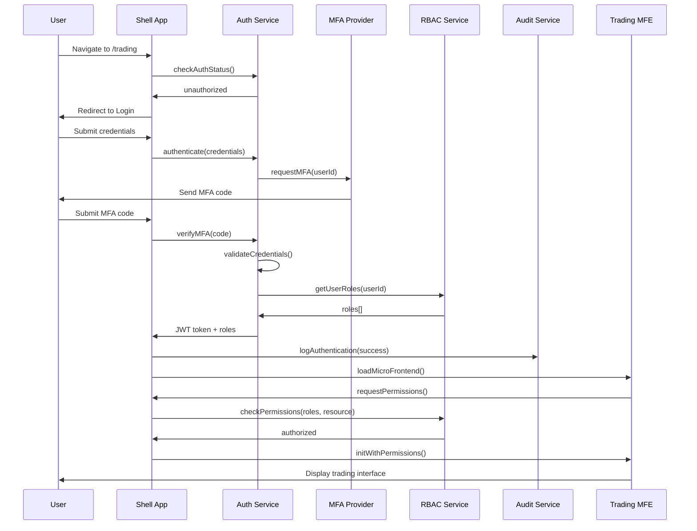
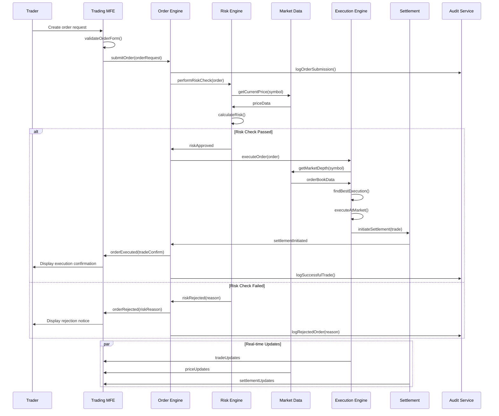
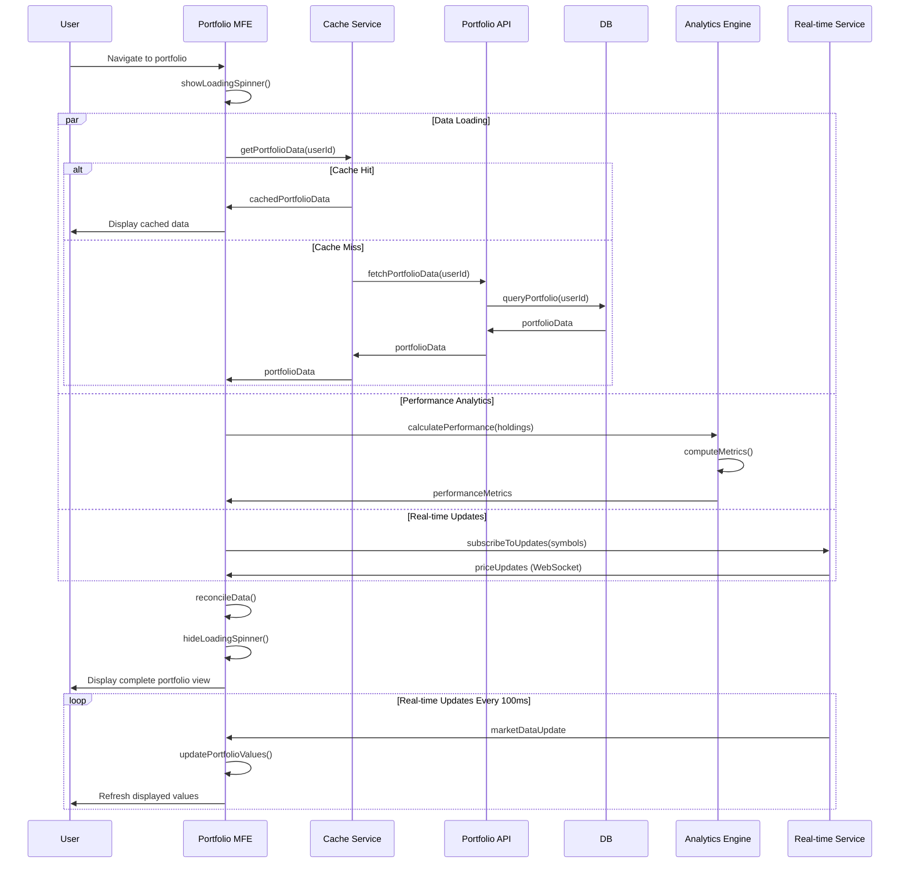
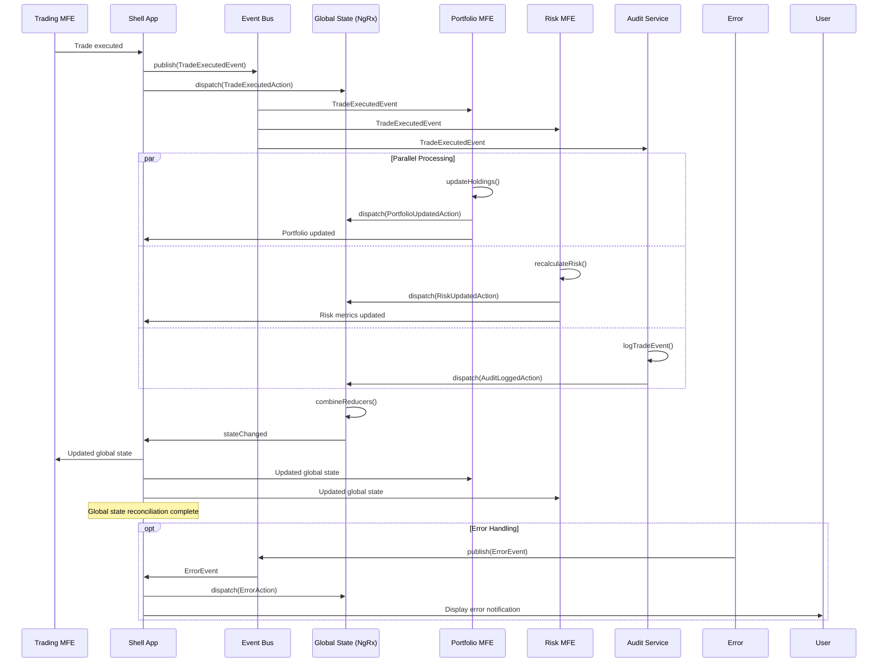
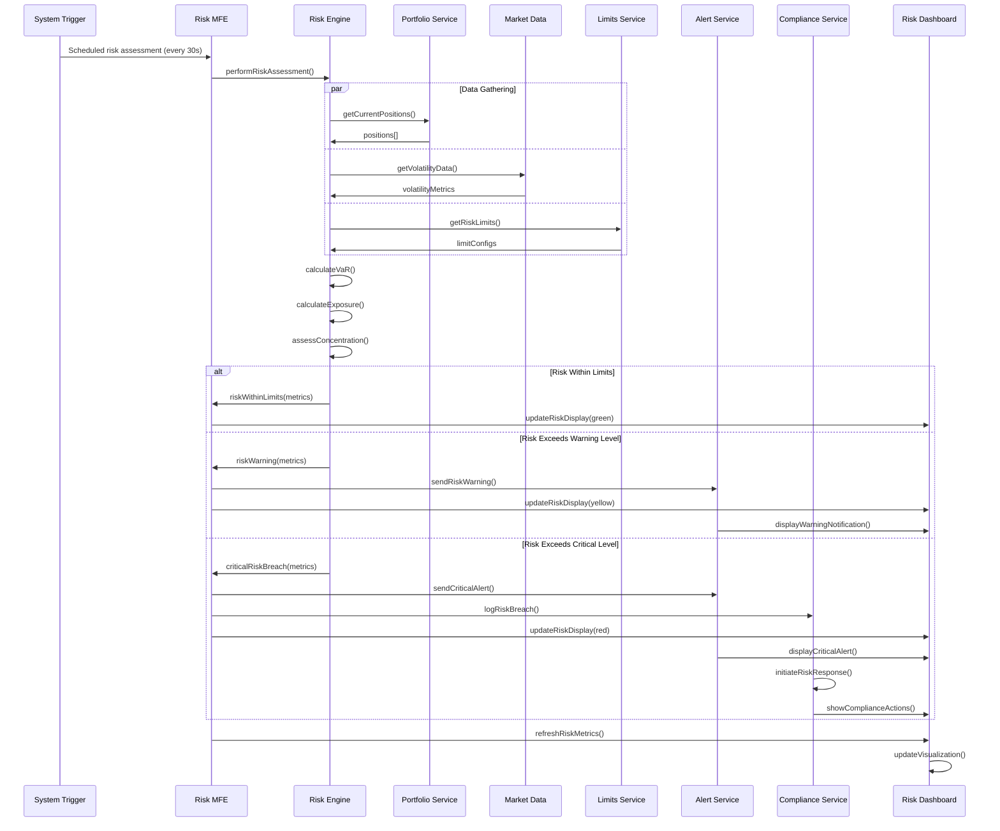
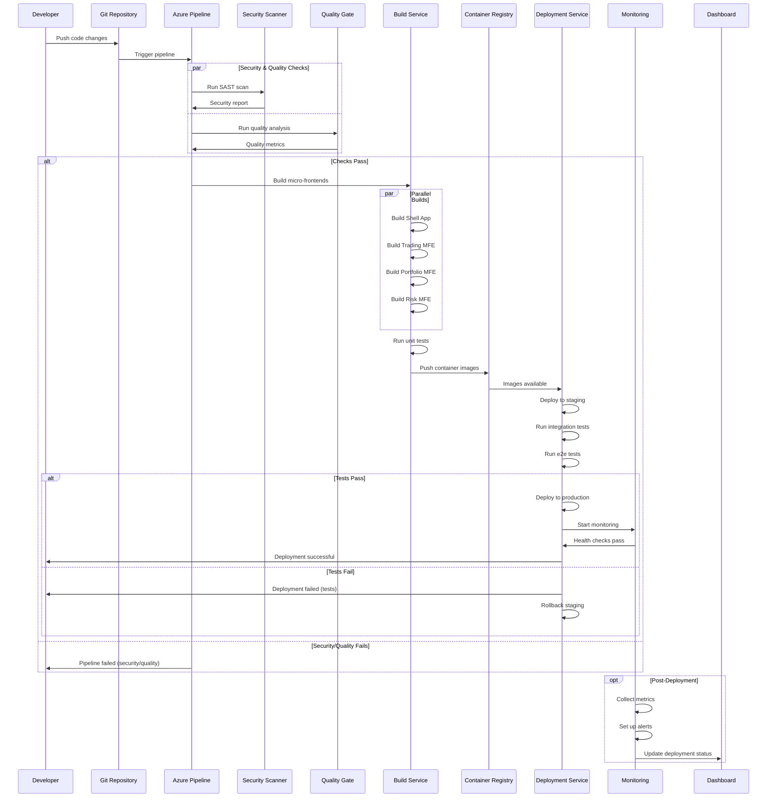
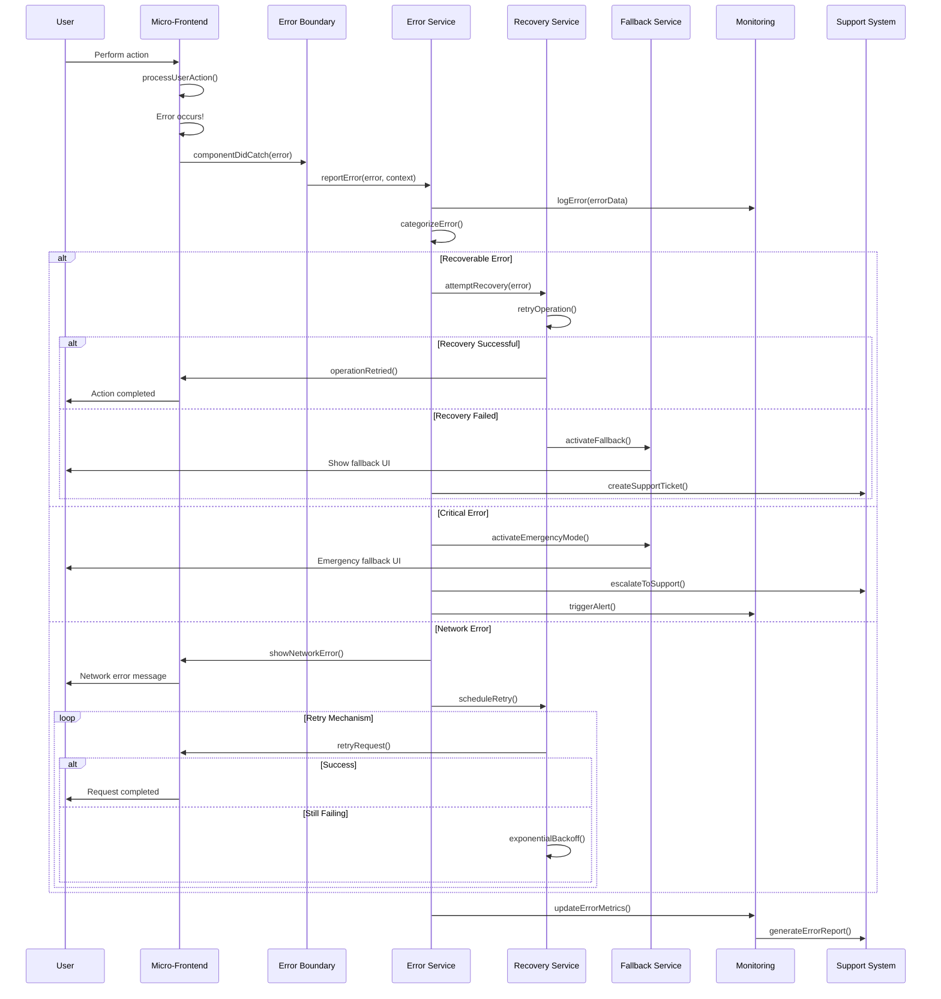
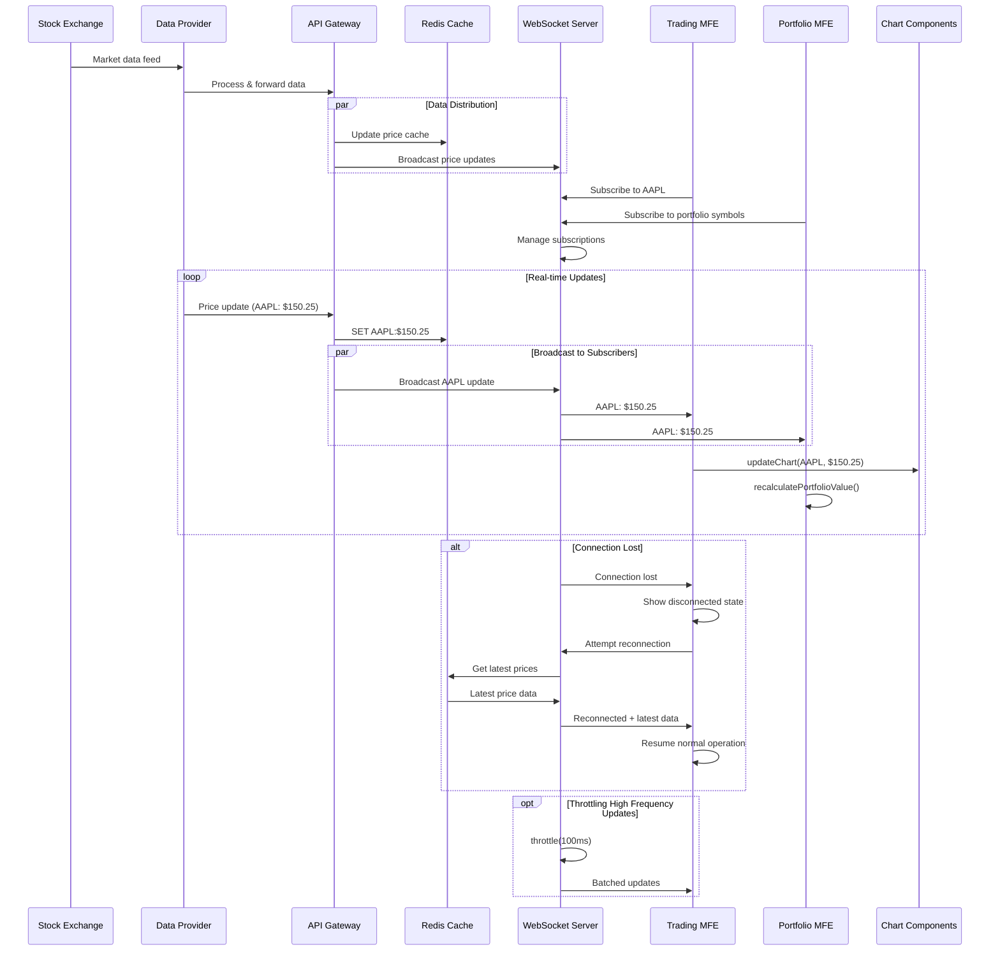
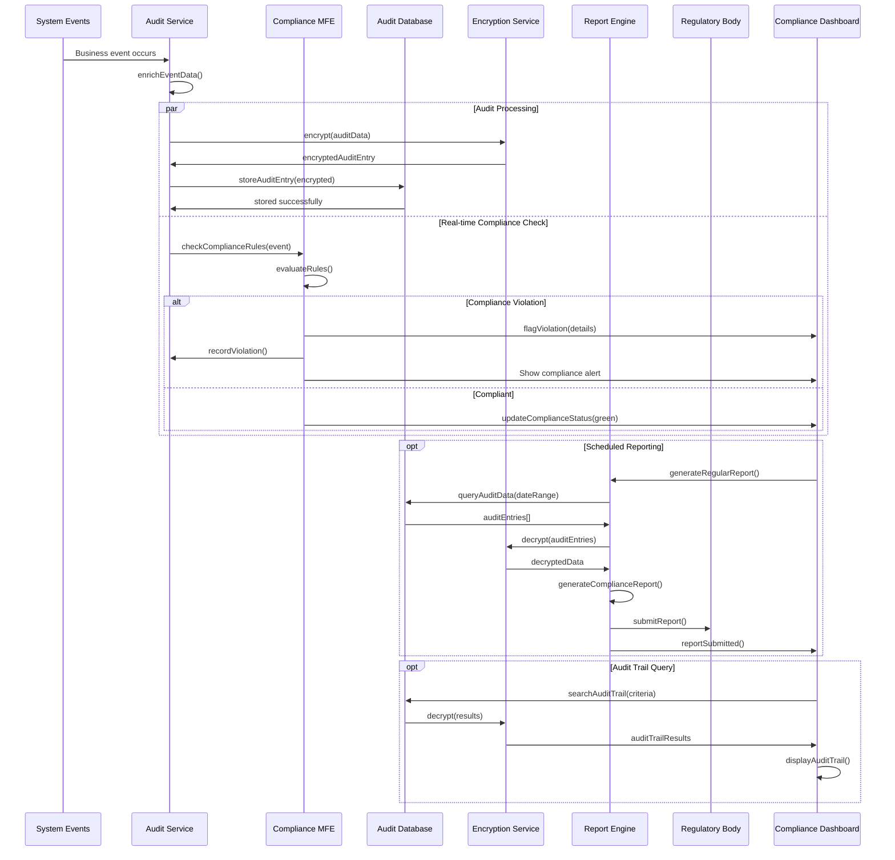

# Sequence Diagrams for Angular FinTech Micro-Frontend Architecture

## Overview

This document contains detailed sequence diagrams for all major flows within the Angular-based FinTech Micro-Frontend Enterprise Architecture. Each diagram represents critical user journeys, system interactions, and business processes.

## Table of Contents

1. [User Authentication Flow](#user-authentication-flow)
2. [Trading Order Execution Flow](#trading-order-execution-flow)  
3. [Portfolio Data Loading Flow](#portfolio-data-loading-flow)
4. [Inter-Micro-Frontend Communication](#inter-micro-frontend-communication)
5. [Risk Assessment Flow](#risk-assessment-flow)
6. [Component Library Usage Flow](#component-library-usage-flow)
7. [CI/CD Deployment Flow](#cicd-deployment-flow)
8. [Error Handling and Recovery Flow](#error-handling-and-recovery-flow)
9. [Real-time Market Data Flow](#real-time-market-data-flow)
10. [Compliance Audit Flow](#compliance-audit-flow)

---

## User Authentication Flow

### Multi-Factor Authentication with RBAC



**Security Considerations:**
- JWT tokens expire after 15 minutes
- Refresh tokens valid for 24 hours
- MFA required for privileged operations
- All authentication events audited
- Rate limiting on login attempts

---

## Trading Order Execution Flow

### Real-time Order Processing with Risk Checks



**Performance Requirements:**
- Order validation: < 10ms
- Risk check: < 50ms  
- Market execution: < 100ms
- End-to-end: < 200ms

---

## Portfolio Data Loading Flow

### Optimized Data Fetching with Caching



**Caching Strategy:**
- L1 Cache: Browser storage (5 minutes)
- L2 Cache: Redis cluster (30 minutes)  
- L3 Cache: CDN edge (1 hour)
- Real-time updates via WebSocket

---

## Inter-Micro-Frontend Communication

### Event-Driven Architecture with Global State Management



**Communication Patterns:**
- Event Bus for loose coupling
- Global State for shared data
- Direct API calls for tight coupling
- WebSocket for real-time updates

---

## Risk Assessment Flow

### Continuous Risk Monitoring and Alerting



**Risk Metrics Monitored:**
- Portfolio Value at Risk (VaR)
- Maximum Drawdown
- Leverage Ratios
- Concentration Risk
- Liquidity Risk
- Counterparty Risk

---

## Component Library Usage Flow

### Design System Integration and Theming

```mermaid
sequenceDiagram
    participant Developer as Developer
    participant MFE as Micro-Frontend
    participant ComponentLib as Component Library
    parameter ThemeService as Theme Service
    participant DesignSystem as Design System
    participant CDN as Component CDN
    participant Analytics as Usage Analytics
    
    Developer->>MFE: Import component
    MFE->>ComponentLib: resolveComponent(name, version)
    
    ComponentLib->>CDN: fetchComponent(name, version)
    CDN->>ComponentLib: componentBundle
    
    ComponentLib->>DesignSystem: getThemeTokens()
    DesignSystem->>ThemeService: getCurrentTheme()
    ThemeService->>DesignSystem: themeConfig
    DesignSystem->>ComponentLib: designTokens
    
    ComponentLib->>ComponentLib: applyTheme(tokens)
    ComponentLib->>MFE: styledComponent
    
    MFE->>ComponentLib: renderComponent(props)
    ComponentLib->>ComponentLib: validateProps()
    ComponentLib->>ComponentLib: applyAccessibility()
    ComponentLib->>ComponentLib: injectAnalytics()
    
    ComponentLib->>Analytics: trackUsage(component, version)
    ComponentLib->>MFE: renderedComponent
    
    MFE->>Developer: Component displayed
    
    opt Theme Change
        ThemeService->>DesignSystem: themeChanged(newTheme)
        DesignSystem->>ComponentLib: updateTheme(tokens)
        ComponentLib->>MFE: re-render components
        MFE->>Developer: Updated themed components
    end
    
    opt A11y Validation
        ComponentLib->>ComponentLib: validateAccessibility()
        ComponentLib->>Analytics: reportA11yMetrics()
    end
```

**Component Library Features:**
- Semantic versioning
- Theme inheritance 
- Accessibility compliance
- Usage analytics
- Performance monitoring
- Bundle optimization

---

## CI/CD Deployment Flow

### Enterprise-Grade Deployment Pipeline



**Pipeline Stages:**
1. **Pre-commit**: Lint, format, unit tests
2. **Security**: SAST, dependency scan, license check
3. **Quality**: Code coverage, complexity analysis
4. **Build**: TypeScript compilation, bundling, optimization
5. **Test**: Unit, integration, e2e tests
6. **Deploy**: Blue-green deployment with health checks
7. **Monitor**: APM, logging, alerting setup

---

## Error Handling and Recovery Flow

### Resilient Error Handling with Graceful Degradation



**Error Categories:**
- **Recoverable**: Network timeouts, temporary service unavailability
- **Degradable**: Non-critical feature failures with fallback options  
- **Critical**: Security breaches, data corruption, system failures
- **User**: Validation errors, permission denied, input errors

---

## Real-time Market Data Flow

### High-Frequency Data Streaming Architecture



**Performance Characteristics:**
- **Latency**: < 10ms from exchange to UI
- **Throughput**: 100,000 updates/second
- **Reliability**: 99.99% uptime
- **Scalability**: Auto-scaling WebSocket clusters

---

## Compliance Audit Flow

### Comprehensive Audit Trail and Regulatory Reporting



**Compliance Features:**
- **Immutable Audit Log**: Tamper-proof blockchain-based storage
- **Real-time Monitoring**: Continuous compliance rule evaluation
- **Automated Reporting**: Scheduled regulatory report generation
- **Retention Policies**: Configurable data retention (7+ years)
- **Access Controls**: Role-based access to audit data

---

## Architecture Decision Impact Analysis

### Sequence Diagram Rationale

Each sequence diagram addresses specific architectural concerns:

#### 1. **Performance Optimization**
- Parallel processing patterns reduce latency
- Caching strategies minimize database calls  
- WebSocket connections enable real-time updates

#### 2. **Security & Compliance**
- Multi-factor authentication flows
- Comprehensive audit logging
- Encryption at every step

#### 3. **Scalability & Resilience**  
- Microservice decomposition
- Circuit breaker patterns
- Graceful degradation strategies

#### 4. **Developer Experience**
- Clear component interaction patterns
- Standardized error handling
- Comprehensive monitoring and observability

---

## Performance Metrics by Flow

| Flow | Target Latency | Throughput | Availability |
|------|---------------|------------|--------------|
| Authentication | < 500ms | 1,000 req/s | 99.99% |
| Trade Execution | < 200ms | 10,000 trades/s | 99.999% |
| Portfolio Loading | < 2s | 5,000 users/s | 99.9% |
| Inter-MFE Communication | < 50ms | Real-time | 99.99% |
| Risk Assessment | < 1s | Continuous | 99.99% |
| Component Loading | < 100ms | CDN cached | 99.99% |
| CI/CD Pipeline | < 15min | 50 deploys/day | 99.9% |

---

## Next Steps Implementation Priority

1. **Phase 1**: Authentication & Shell Application (Weeks 1-2)
2. **Phase 2**: Trading Micro-Frontend (Weeks 3-4)  
3. **Phase 3**: Portfolio Management (Weeks 5-6)
4. **Phase 4**: Risk Management (Weeks 7-8)
5. **Phase 5**: Component Library Enhancement (Weeks 9-10)
6. **Phase 6**: Advanced Monitoring & Compliance (Weeks 11-12)

Each phase includes comprehensive testing, security validation, and performance optimization to ensure enterprise-grade quality standards.